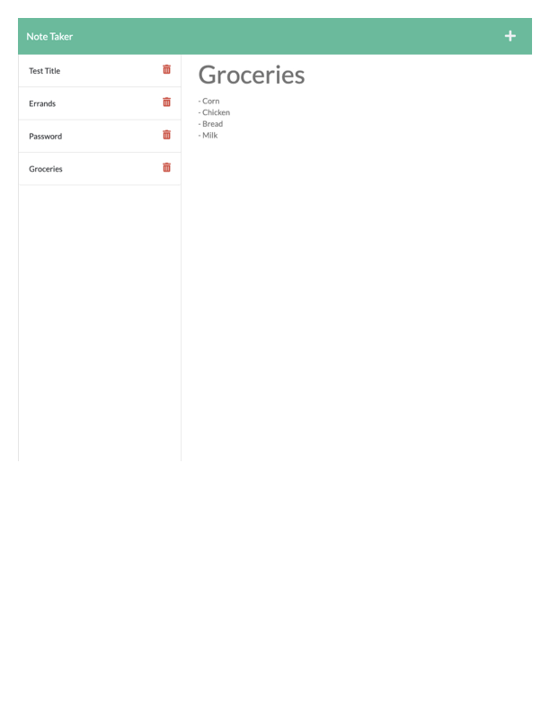

# HOMEWORK11_NOTE_TAKER

# OOP - Team Profile Generator

## Description: 
 The purpose of this project was create a note taker app using express.js. This includes user ability to:
 - Generate existing notes upon refresh
 - Create a new note to be saved on the left side-bar panel
 - Search existitng notes and have then render in read-only to the main section

## Table of Contents 

* [Installation](#installation)
* [Usage](#usage)
* [Contributors](#contributors)
* [License](#license)
  
## Installation 
 No installtion process needed for this app. Clikc on the link and start adding notes!

## Usage 
 

## Contributors 

TA , AskBCS , Study Group

## Testing 
No test cases available

## License 
MIT 

## Questions: 
If you have any questions, please feel free to contact me at:
  Email Address: christa.baccas@gmail.com
  Github Account: https://github.com/christa-baccas

